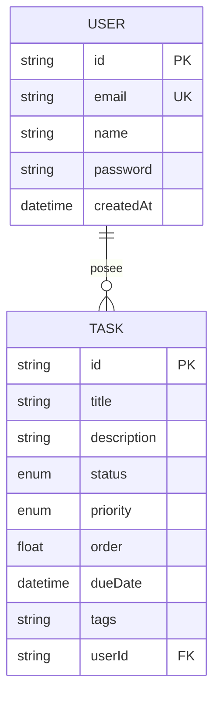

# Modelo de Datos: Kan-B AI

Este documento describe la estructura de la base de datos gestionada por Prisma ORM.

## Diagrama de Entidad-Relación (ER)

## Diccionario de Datos

### Tabla: `User`
Representa a los usuarios autenticados del sistema.

| Campo      | Tipo    | Descripción                          |
| ---------- | ------- | ------------------------------------ |
| `id`       | CUID    | Identificador único autogenerado.    |
| `email`    | String  | Correo electrónico único para login. |
| `password` | String  | Hash de la contraseña (bcrypt).      |
| `name`     | String? | Nombre opcional del usuario.         |

### Tabla: `Task`
Representa las tareas dentro del tablero Kanban.

| Campo      | Tipo      | Valor Defecto | Descripción                                                           |
| ---------- | --------- | ------------- | --------------------------------------------------------------------- |
| `id`       | CUID      | -             | Identificador de la tarea.                                            |
| `title`    | String    | -             | Título corto de la acción.                                            |
| `status`   | Enum      | `OPEN`        | Estado en el tablero (OPEN, PENDING, IN_PROGRESS, REVIEW, COMPLETED). |
| `priority` | Enum      | `MEDIUM`      | Importancia (LOW, MEDIUM, HIGH, URGENT).                              |
| `order`    | Float     | `0`           | Posición decimal para reordenamiento fluido.                          |
| `dueDate`  | DateTime? | null          | Fecha límite de cumplimiento.                                         |
| `userId`   | String    | -             | Relación con el dueño de la tarea (Cascade Delete).                   |

## Enums Técnicos

- **TaskStatus:** `OPEN`, `PENDING`, `IN_PROGRESS`, `REVIEW`, `COMPLETED`
- **TaskPriority:** `LOW`, `MEDIUM`, `HIGH`, `URGENT`
